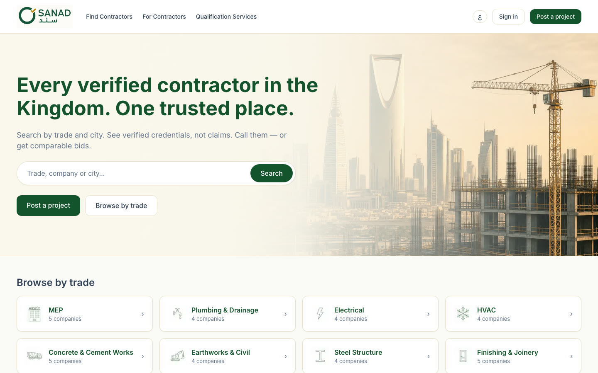
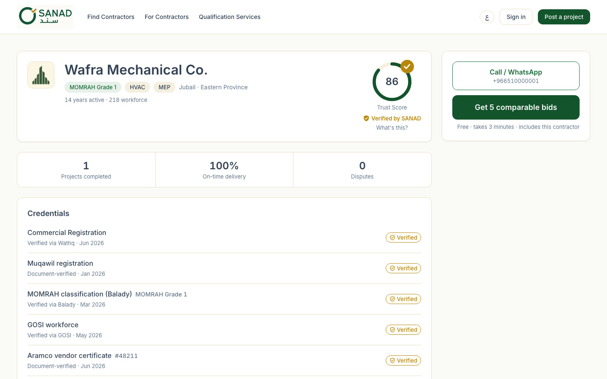
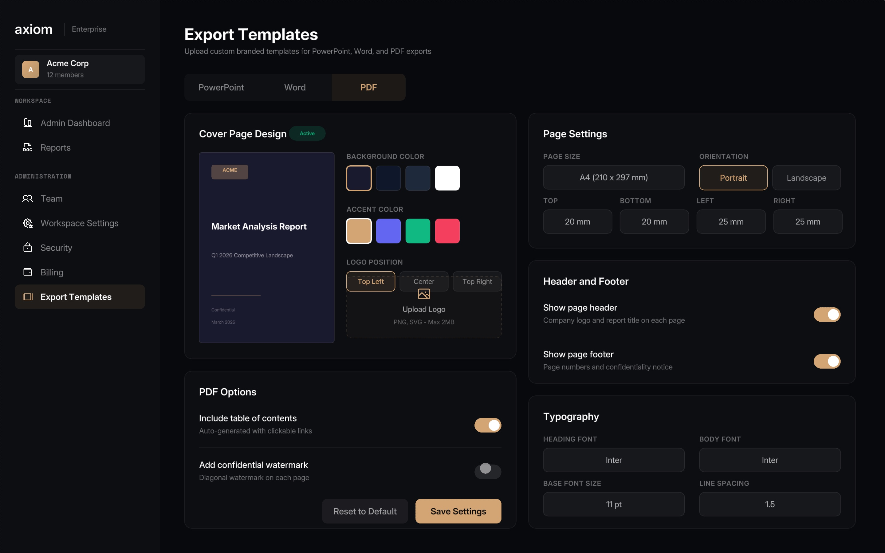

# Mohammed Omer Shaik

## AI Product Lead and Solutions Architect

I turn unclear operating problems into working products. My work combines product management, software architecture, data, and applied AI. I define workflows, write requirements, shape APIs and data models, build alongside engineers, test the result, and stay responsible for release quality.

Recent work through CodeSpellStudio covered procurement, research, developer tools, investment decision systems, and real estate. I use AI assisted development for research, specifications, prototyping, implementation, testing, and review. Product decisions, validation, and accountability remain human responsibilities.

[Portfolio](https://omershaik.com) · [LinkedIn](https://linkedin.com/in/omershaik) · [Email](mailto:mohammed@omershaik.com)

## Selected work

### SANAD

A bilingual procurement product built for a founder preparing commercial launch. It covers contractor discovery, comparable bids, messaging, milestones, approvals, purchase orders, invoices, and audit records.

**126 product screens · 452 registered states · 904 English and Arabic browser cases**

[Open the live demo](https://sanad-demo.onrender.com/) · [Read the portfolio case study](https://omershaik.com/#work)

  
  

### LaserEyedBen

A partner backed crypto intelligence agent that ran in production. The system combined market, blockchain, developer, news, and social signals through an event driven workflow with retrieval, personality controls, fallbacks, rate limits, and operating checks.

**About 16 live sources · More than 20 intelligence engines · 85 percent cache hit rate below 100 milliseconds · Full response benchmark below 1.5 seconds**

[View the repository](https://github.com/omershaik/LaserEyedBen)

### Lorenth

An agentic research system that plans a question, gathers current evidence, produces cited findings, and exports a report as a document, presentation, or PDF. The repository includes the React interface, FastAPI services, data models, research orchestration, and export engines.

[View the repository](https://github.com/omershaik/Lorenth)

  

### Palate

An open source Model Context Protocol server that gives AI coding tools a structured design vocabulary. It includes typed contracts, multi stage routing, compatibility checks, validation, automated tests, and contributor documentation.

[View the repository](https://github.com/omershaik/Palate)

### PropertyLedger and PARCEL

Two real estate decision systems shaped by direct operating work. PropertyLedger models a legal and title review workflow with explainable scoring, human approval, audit events, and public verification. PARCEL turns official registry and project data into comparable research views while showing provenance and missing data.

[View PropertyLedger](https://github.com/omershaik/PropertyLedger) · [View PARCEL](https://github.com/omershaik/PARCEL)

## How I work

* **Product:** discovery, product strategy, roadmaps, requirements, user journeys, user stories, backlog decisions, acceptance criteria, user acceptance testing, and launch planning
* **AI systems:** agents, retrieval augmented generation, embeddings, semantic search, tool calling, structured outputs, prompt and context engineering, evaluation, grounding, guardrails, and human review
* **Engineering:** Python, TypeScript, JavaScript, Java, React, Next.js, Node.js, FastAPI, REST APIs, PostgreSQL, SQL, Redis, Supabase, Weaviate, Docker, and Git
* **Quality:** unit, integration, and browser testing; schema validation; authentication; authorization; audit logging; retries; fallbacks; rate limiting; monitoring; and release controls

## Background

* AI Product Lead and Solutions Architect, CodeSpellStudio, Sep 2024 to Jul 2026
* Product Owner, Content Moderation Tools, Majorel Canada, Oct 2023 to Aug 2024
* Quality Assurance and Process Improvement Analyst, Co-op, Elite Mobility Mfg., May 2023 to Aug 2023
* Software Architect and Technical Product Lead, Bismi Services, May 2018 to Jun 2022

## Education and certifications

* Ontario Graduate Certificate, Artificial Intelligence and Machine Learning, Lambton College
* Bachelor of Engineering, Computer Science and Engineering, P.D.A. College of Engineering
* Professional Scrum Product Owner I, Scrum.org
* AI in Fintech Essential Training, LinkedIn Learning
* Excel Essential Training (Microsoft 365), National Association of State Boards of Accountancy

## Contact

Toronto, Ontario

[omershaik.com](https://omershaik.com) · [linkedin.com/in/omershaik](https://linkedin.com/in/omershaik) · [mohammed@omershaik.com](mailto:mohammed@omershaik.com)
