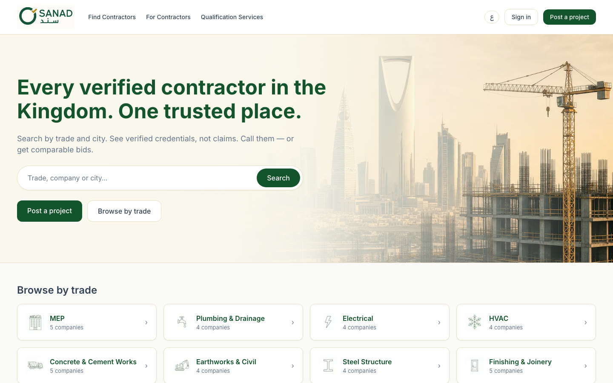
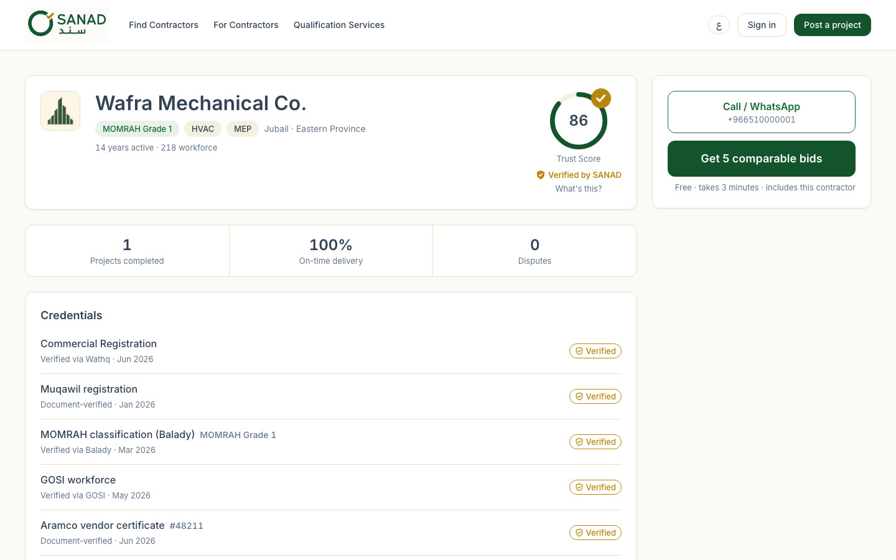
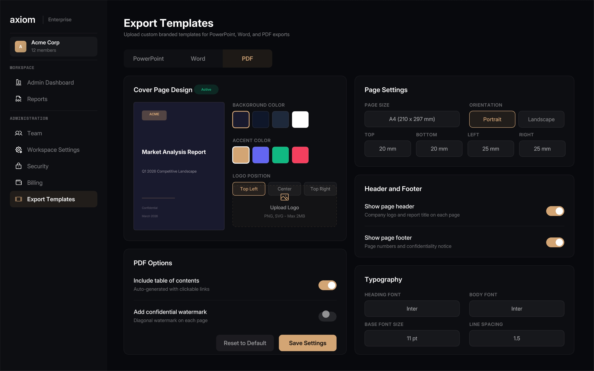

# Mohammed Omer Shaik

## Forward Deployed AI Engineer

I turn business requirements into working AI applications. I work across client discovery, workflow design, Python and TypeScript implementation, API integrations, testing and release preparation. My product and banking systems background helps me connect the implementation to the problem it needs to solve.

My work includes a bilingual procurement product built for a client, research workflows with source grounding, and MCP tooling for AI coding assistants. I use Claude Code, Codex and Cursor during development, and take responsibility for reviewing the code, debugging behavior and checking results.

[Portfolio](https://omershaik.com) · [LinkedIn](https://linkedin.com/in/omershaik) · [Email](mailto:mohammed@omershaik.com)

## Selected work

### SANAD

A bilingual procurement product built for a founder preparing commercial launch. It covers contractor discovery, comparable bids, messaging, milestones, approvals, purchase orders, invoices, and audit records.

I translated procurement requirements into application workflows, permissions and English and Arabic browser cases. A demo is available; external verification, messaging and payment integrations remain behind replaceable adapters.

[Open the live demo](https://sanad-demo.onrender.com/) · [Read the portfolio case study](https://omershaik.com/#work)

  
  

### LaserEyedBen

A partner backed crypto intelligence agent that ran publicly and is now paused. I implemented LLM query classification and routing between PostgreSQL and Weaviate for transactional records and semantic retrieval, alongside external data integrations and failure handling.

The public repository contains a case study and selected implementation samples, not the complete production service.

[View the repository](https://github.com/omershaik/LaserEyedBen)

### Lorenth

A Python and FastAPI research application with custom agentic orchestration: research framing, query generation, external search, streamed report synthesis and citations. I implemented query fallbacks and checks for report structure and numeric source grounding, plus document export workflows.

This is an MVP. Source citations and heuristic checks do not establish factual accuracy; live model evaluation remains separate from application tests.

[View the repository](https://github.com/omershaik/Lorenth)

  

### Palate

An open source TypeScript Model Context Protocol (MCP) server for AI coding assistants. It exposes five tools for design routing, validation and reference lookup, with structured inputs, error responses, resources and prompts.

It is a pre-release tool server, not an autonomous agent. Local MCP integration has been exercised; routing accuracy still has open test failures.

[View the repository](https://github.com/omershaik/Palate)

### PropertyLedger and PARCEL

Two real estate prototypes shaped by direct operating work. PropertyLedger demonstrates a property review workflow with example checks, explainable scoring, human approval and audit events. PARCEL uses demonstration data to build comparable research views while showing provenance and missing data. Neither is a verified legal or registry data service.

[View PropertyLedger](https://github.com/omershaik/PropertyLedger) · [View PARCEL](https://github.com/omershaik/PARCEL)

## How I work

* **Client delivery:** requirements discovery, workflow mapping, solution design, API contracts, acceptance criteria, demonstrations and release planning
* **AI applications:** OpenAI and Anthropic APIs, custom agentic workflows, search grounding, semantic retrieval, structured outputs, prompt engineering, MCP and human review
* **Engineering:** Python, TypeScript, JavaScript, Java, React, Next.js, Node.js, FastAPI, REST APIs, PostgreSQL, SQL, Redis and Weaviate
* **Quality and tooling:** pytest, Vitest, Playwright, Pydantic, Zod, authentication, audit logging, error handling, output validation, Docker and Git

I am based in Toronto and interested in Forward Deployed AI Engineer, Applied AI Engineer and Generative AI Engineer roles where understanding the user's workflow is part of the engineering work.

## Background

* AI Product Lead and Solutions Architect, CodeSpellStudio, Sep 2024 to Jul 2026
* Product Owner, Content Moderation Tools, Majorel Canada, Oct 2023 to Aug 2024
* Quality Assurance and Process Improvement Analyst, Co-op, Elite Mobility Mfg., May 2023 to Aug 2023
* Software Architect and Technical Product Lead, Bismi Services, May 2018 to Jun 2022

## Education and certifications

* Ontario Graduate Certificate, Artificial Intelligence and Machine Learning, Lambton College
* Bachelor of Engineering, Computer Science and Engineering, P.D.A. College of Engineering
* Professional Scrum Product Owner I, Scrum.org
* AI in Fintech Essential Training, LinkedIn Learning
* Excel Essential Training (Microsoft 365), National Association of State Boards of Accountancy

## Contact

Toronto, Ontario

[omershaik.com](https://omershaik.com) · [linkedin.com/in/omershaik](https://linkedin.com/in/omershaik) · [mohammed@omershaik.com](mailto:mohammed@omershaik.com)
